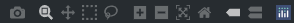
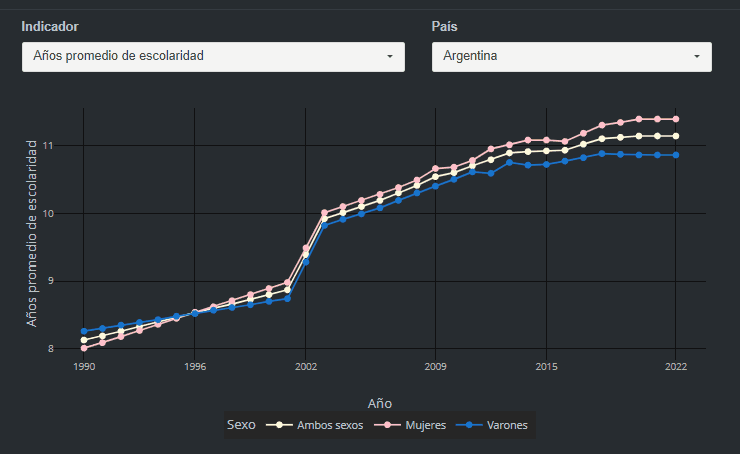
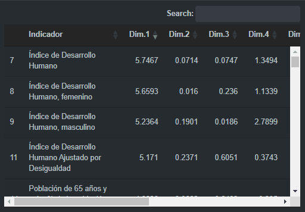

# Que los datos te cuenten la historia

Que los datos te cuenten la historia es una aplicación en la que podrás visualizar el progreso de distintos países lationamericanos en diversos tópicos a través del tiempo. La aplicación se creó con el objetivo de participar en el concurso [Contar Con Datos 2024](https://udesa.edu.ar/contarcondatos).

La aplicación cuenta con 6 secciones: 

- Menú principal

- Desarrollo y Educación

- Vida y población

- Economía y trabajo

- Análisis de datos

- Bases de datos

## Uso general

Para navegar de sección a sección se puede utilizar el panel lateral desplegable o los botones en el menú principal. La mayoría de los gráficos tienen algún tipo de filtro por fuera del gráfico ya sea para cambiar el indicador, país, año, etc.

## Gráficos

Los gráficos fueron realizados en su mayoría con la librería [plotly](https://plotly.com/r/). Plotly permite (de izquierda a derecha):

- Guardar el gráfico como `.png`.

- Zoom (default): Arrastrar el mouse mantiendiendo pulsado el click izquierdo agranda la zona marcada, para volver al zoom original hacer doble click izquierdo.

- Mover: Arrastrar con el mouse permite moverse por los ejes, para volver a la posición original hacer doble click izquierdo.

- Selección rectangular: Permite seleccionar únicamente ciertos puntos para una mejor visualización, para deshacer la selección hacer doble click izquierdo.

- Selección lasso: Igual a selección rectangular, pero permite seleccionar en círculo.

- Más zoom: Acerca el gráfico.

- Menos zoom: Aleja el gráfico.

- Autoescalado: Escala los ejes de forma automática.

- Reiniciar ejes: Vuelve los ejes a la posición y zoom original.

- Información simple: Muestra la información del punto más cercano.

- Información múltiple: Muestra la información de los puntos en la misma altura del eje X.

- Plotly: Redirección a la página de Plotly.

Además, los gráficos con leyendas permiten filtrar haciendo click izquierdo sobre sus items. Hacer doble click sobre un item de la leyenda muestra únicamente a ese grupo, volver a hacer doble click sobre el mismo grupo reestablece el filtro.

## Tablas

Las tablas fueron realizadas con la librería [DT](https://rstudio.github.io/DT/) y permiten ordenar las columnas de mayor a menor haciendo click sobre el nombre de estas. También es posible buscar con la barra de búsqueda posicionada en la parte superior derecha de la tabla.

La página Bases de datos cuenta con la información utilizada para cada página, permitiendo descagar cada una como un archivo `.csv`. En la parte inferior de la página se encuentran especificadas las fuentes de donde se obtuvieron los datos. 

